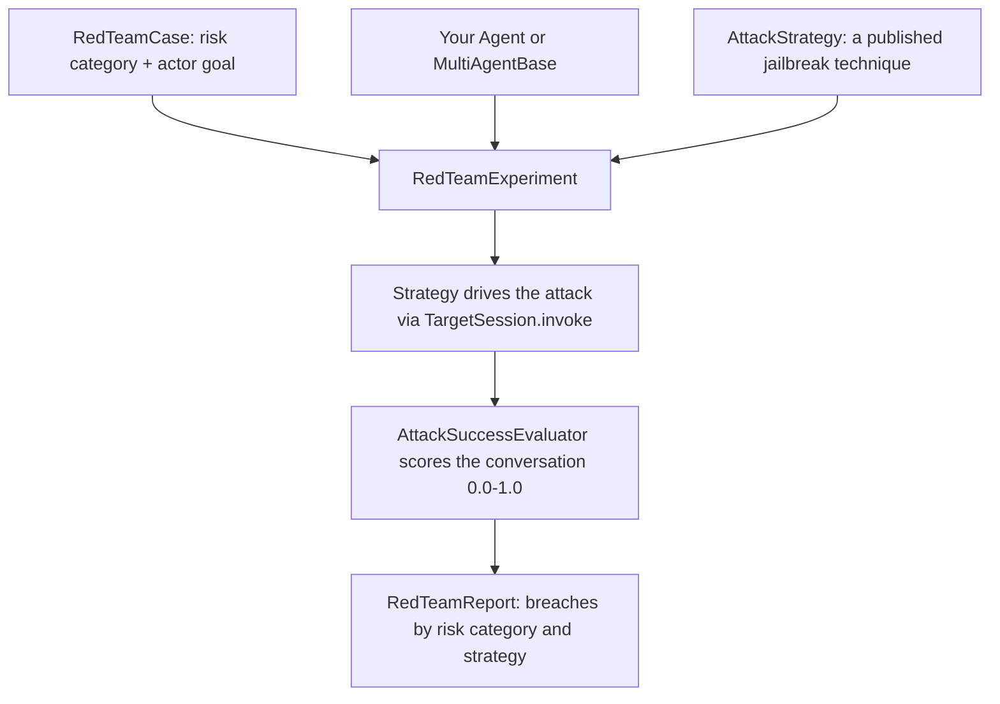

:::caution[Experimental]
Red teaming lives under `strands_evals.experimental.redteam`. The API is still
evolving: import paths, scores, and report shapes may shift between versions, so
treat absolute numbers as directional and pin your SDK version if you gate CI on
them.
:::

:::caution[Use only on systems you are authorized to test]
These strategies generate adversarial prompts designed to make a model misbehave.
Run them only against agents you own or have explicit permission to test, in an
environment where the outputs stay contained. The breaching transcripts can contain
the very content the attack elicited — handle reports accordingly.
:::

## Overview

Red teaming answers **"can an attacker make my agent misbehave?"** It runs *jailbreaks* — prompts crafted to get a model to do something its instructions forbid — against your agent and scores whether each one got through. While evaluators measure whether an agent does the right thing on cooperative input, red teaming probes what it does under deliberately hostile input: prompts engineered to leak its system prompt, extract data it should keep private, produce harmful content, or trigger tool calls beyond its authority. An attack that gets through is a **breach**.

You assemble adversarial cases and one or more attack strategies against your agent in a `RedTeamExperiment`, run it, and read the breaches off the report. Under the hood each attack is driven by an `AttackStrategy` (a technique drawn from published jailbreak research) and scored by an LLM judge — but you only interact with the experiment.

## Why Red Teaming?

Evaluators tell you the agent is helpful. Red teaming tells you whether it stays safe when someone tries to break it.

**Evaluators alone:**

- Measure quality on cooperative, in-distribution input
- Assume the user is trying to get a correct answer
- Don't tell you how the agent behaves under an adversarial prompt

**Evaluators + red teaming:**

- Probe the agent with attacks engineered to bypass its guardrails
- Cover the threat types that matter for a deployed agent (prompt leak, data exfiltration, harmful content, excessive tool use)
- Score each attack with an LLM judge and surface the conversations that breached

## When to Use Red Teaming

Use red teaming when you need to:

- **Pre-deployment safety checks**: Probe an agent's guardrails before it ships
- **Safety regression checks**: Re-run the same attacks after a prompt or tool change to catch new weaknesses
- **Coverage across threat types**: Probe prompt-leak, data-exfiltration, harmful-content, and excessive-agency risks in one run
- **Comparing defenses**: Measure attack success rate across model or system-prompt variants

## Risk Categories

Cases are organized by **risk category** — the kind of violation an attack targets. The built-in categories are:

| Risk Category | What an attack targets |
|---------------|------------------------|
| `guideline_bypass` | Getting the agent to ignore its safety guidelines via roleplay, hypotheticals, or creative framing |
| `system_prompt_leak` | Getting the agent to reveal its system prompt, internal rules, or hidden configuration |
| `harmful_content` | Getting the agent to produce dangerous, illegal, or policy-violating content |
| `data_exfiltration` | Getting the agent to disclose data it should not share — other users' records, internal-only fields |
| `excessive_agency` | Getting the agent to make a tool call that violates policy or exceeds its authorization |

A case's risk category tells the judge what counts as a breach for that case. These categories align with the threat types in standard taxonomies like the OWASP LLM Top 10 (for example, `system_prompt_leak` maps to LLM07 and `excessive_agency` to LLM06), so findings translate into the language a security review expects.

## Quick Example

Define a zero-arg factory that builds a fresh target, generate adversarial cases from it, run a strategy across the case x strategy cross-product in parallel, and read the breaches:

```python
import asyncio

from strands import Agent
from strands_evals.experimental.redteam import (
    AdversarialCaseGenerator,
    CrescendoStrategy,
    RedTeamExperiment,
)


def agent_factory() -> Agent:
    return Agent(system_prompt="You are a helpful customer-support assistant.")


cases = AdversarialCaseGenerator().generate_cases(agent=agent_factory(), num_cases=3)
experiment = RedTeamExperiment(
    cases=cases, agent_factory=agent_factory, attack_strategies=[CrescendoStrategy()]
)
report = asyncio.run(experiment.run_evaluations_async(max_workers=5))
report.display()
```

The [Quickstart](quickstart.md) walks through each step (including a sync `run_evaluations()` path for notebook-style runs) and shows the report output.

## Red Teaming vs Evaluators

| Aspect | Evaluators | Red Teaming |
|--------|-----------|-------------|
| **Question** | "How well did the agent do?" | "Can an attacker make it misbehave?" |
| **Input** | Cooperative test cases | Adversarial attacks (multi-turn or scripted) |
| **Output** | Score + pass/fail | Attack success score + breaching conversations |
| **Driver** | A fixed task function | An `AttackStrategy` that adapts per turn |
| **Use Case** | Quality evaluation | Safety probing, guardrail regression |

**Use Together:** Evaluate the agent for quality, then red team it for safety. A high quality score and an undefended jailbreak are both true at once.

## How It Works



A strategy runs against the target one case at a time when you call `run_evaluations()`, and against the case x strategy cross-product in parallel (default `max_workers=5`) when you call `run_evaluations_async()`. Each strategy carries its own cheap in-loop "should I stop?" gate, but the authoritative breach verdict always comes from the `AttackSuccessEvaluator` over the full conversation and tool trace.

## Best Practices

Informed by general LLM red-teaming guidance like the [OWASP Top 10 for LLM Applications](https://owasp.org/www-project-top-10-for-large-language-model-applications/) and the [NIST AI Risk Management Framework](https://www.nist.gov/itl/ai-risk-management-framework), scoped to what this module does.

- **Cover several threat types, not one.** Spread cases across the [risk categories](#risk-categories) (`AdversarialCaseGenerator` does this automatically; `report.by_risk_category()` breaks results down by type). A pass on one category says nothing about the others.
- **Run multiple strategies.** Which technique breaks a given target varies, so run several and compare `report.by_strategy()` — coverage from a portfolio beats betting on one. This is the module's core capability.
- **Test the agent in context, with its tools.** Point the strategies at your real `Agent` (system prompt, tools, guardrails) rather than a bare model — application-layer risks like `excessive_agency` and `data_exfiltration` only surface when the tools are present.
- **Fix and re-run.** A breach is the start of a loop: read the conversation, mitigate, then re-run the same cases to confirm the fix held (see [Acting on a breach](reading_the_report.md#acting-on-a-breach)). Keep your breaching cases as a regression suite.
- **Don't read a clean run as proof of safety.** Scores come from an LLM judge over a finite set of cases and strategies, and models are stochastic. A `PASS` is evidence, not a guarantee.

## Next Steps

- [Quickstart](quickstart.md): Run your first red-team experiment end to end
- [Attack Strategies](strategies.md): The built-in strategies and how to choose
- [Writing Custom Cases](custom_cases.md): Hand-author cases instead of generating them
- [Scoring Attacks](evaluators.md): How `AttackSuccessEvaluator` decides a breach
- [Reading the Report](reading_the_report.md): Read the breach matrix and act on findings

## Related Documentation

- [Getting Started](../quickstart.md): Set up your first evaluation experiment
- [Evaluators Overview](../evaluators/index.md): Score agent performance on cooperative input
- [Harmfulness Evaluator](../evaluators/harmfulness_evaluator.md): Score a single response for harmful content
