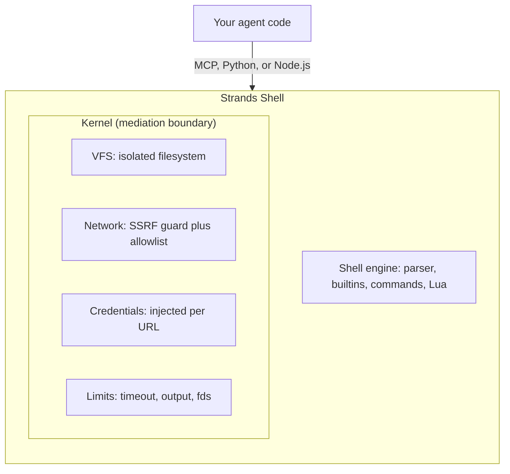

Agents run shell commands in tight loops: install dependencies, run tests, grep for errors, iterate. Those loops need to be fast, and they need to be contained. An agent that can run `curl` can also read your cloud credentials, reach your internal network, and overwrite files you didn't intend to expose.

Strands Shell is a Bourne-compatible shell that runs inside your own process. It ships `grep`, `sed`, `jq`, `curl`, `find`, and dozens of other commands without calling `fork`, `exec`, or a raw syscall. You declare what the agent can reach (files, URLs, credentials) up front, and everything else doesn't exist as far as the agent is concerned. The source is on [GitHub](https://github.com/strands-agents/shell).

## Why a virtual shell

Most agent setups use a container or a cloud sandbox to isolate command execution. Both work, and both cost something on every command: a Docker container adds a cold start and a daemon to manage; a cloud sandbox adds a network round trip and a platform dependency. When an agent runs hundreds of commands per task, that overhead compounds.

Strands Shell takes a different approach. The isolation boundary is an in-process virtual filesystem and a mediation layer, not an operating-system primitive. Because there's no container to start and no VM to provision, constructing a shell and running a command costs under a millisecond.

| | Docker | Cloud sandbox | Strands Shell |
|---|---|---|---|
| Cold start | ~200ms | ~1s (network) | under 1ms |
| Isolation | Container namespace | MicroVM | In-process VFS |
| Network | iptables or sidecar | Platform policy | URL allowlist plus SSRF guard |
| Secrets | Environment variables the agent can read | Platform-specific | Injected per request, agent doesn't see them |
| Setup | Docker daemon | API key plus network | `pip install strands-shell` |
| Platforms | Linux | Cloud only | macOS, Linux, WASM |

This is a different tradeoff, not a strictly better one. A container isolates at the kernel; Strands Shell isolates at the process. The [security model](#what-strands-shell-is-not) section below draws that line precisely, because picking the wrong tool for an adversarial workload is a real risk.

## How it works

Your code talks to the shell through one of three surfaces: an MCP server, the Python API, or the Node.js API. Every command, file read, and network request flows through the Kernel, which is the single mediation boundary.

The engine parses and runs shell syntax and when a command needs to touch the outside world, it asks the Kernel, and the Kernel decides. The filesystem is an in-memory VFS with explicit bind mounts, network access goes through an SSRF guard that blocks private address ranges by default, and credentials are injected per request and stripped before the agent can read them.

Strands Shell is written in Rust and compiles from one source to native bindings for Python (via PyO3) and Node.js (via napi-rs), plus a WASM target. All three surfaces expose the same functionality.

## What you control

A fresh shell starts empty without access to files, network, or credentials. You grant access explicitly through three mechanisms:

- **Binds** map a host directory into the shell's filesystem. A `copy` bind snapshots the directory at construction time, isolating the agent from your live files. A `direct` bind passes reads and writes through to the host in real time. Prefer `copy` for source code and reserve `direct` for output directories.

- **Credentials** attach a secret to a URL prefix. When a command makes a request to a matching URL, the Kernel injects the credential at request time. The agent doesn't hold the secret, and the Kernel doesn't re-inject on a redirect, even back to the same host.

- **Allowed URLs** widen the network policy. By default the SSRF guard blocks private ranges (RFC1918, link-local, loopback, and cloud metadata endpoints) while letting public URLs through. Add a prefix to the allowlist to permit a specific internal host.

The [Configuration](configuration.md) guide covers each of these in depth, including the TOML format that lets you declare the whole policy in a file.

## What Strands Shell is not

Strands Shell is a mediation layer, not a hardened sandbox. The Kernel enforces what the agent *should* reach through deny-by-default policy, and it runs in the same process as your code. It doesn't protect against memory-safety exploits in the shell engine itself, timing side channels, or an attacker who already controls the host process.

The distinction matters for your threat model:

- For "my agent shouldn't touch anything I haven't explicitly allowed," the Kernel handles it. This is the common case: a coding agent, a research agent, a CI assistant.
- For "an untrusted tenant is running arbitrary adversarial code," you need OS-level isolation. Run each Strands Shell instance inside a container or microVM, and let the Kernel handle the in-process mediation on top.

Resource limits (timeouts, output caps, file-descriptor and inode limits) are best-effort. They stop a runaway agent from filling memory or hanging forever but they don't stop someone actively trying to break out. For hard guarantees, use OS-level cgroups.

A Strands Shell instance is single-owner. If you serve multiple agents, create one shell per session. Construction is cheap (no containers, no VMs, just an in-memory VFS), so spinning one up per request is the intended pattern.

## Next steps

- [Quickstart](quickstart.md): install the shell and run your first sandboxed command through MCP, Python, or Node.js.
- [Configuration](configuration.md): bind directories, inject credentials, set the network allowlist, and load it all from TOML.
- [Commands](commands.md): the full command inventory, supported flags, and known gaps versus GNU coreutils.
- [MCP Server](mcp-server.md): expose the shell to any MCP-compatible agent framework over stdio.
- [Security Model](security.md): the Kernel boundary, the SSRF guard, credential handling, and how to layer OS isolation for adversarial workloads.
